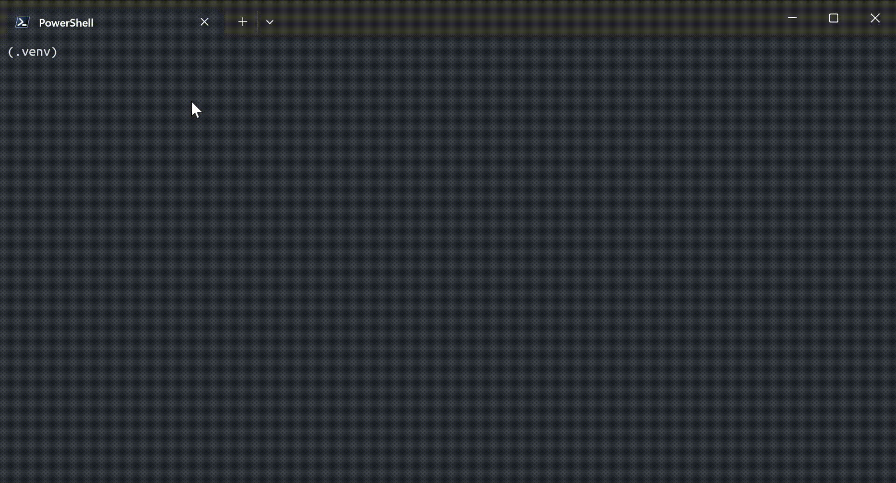
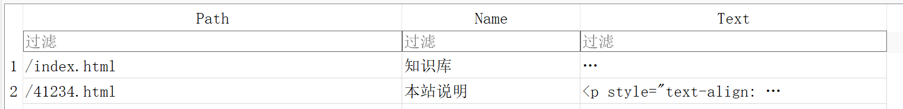

<div align="center">

# E-Spider | 【E 知识库】爬虫

</div>

---

## 关于

爬虫练手项目，用于爬取本地部署的靶场网站，请勿用于非法爬取公开网站！

## 使用方法

### 0. 克隆项目

```shell
git clone https://github.com/oldkingOK/E-Spider.git
```

### 1. 安装依赖

确保已安装Python 3.x，并执行以下命令安装依赖：

> 推荐使用虚拟环境
> 
> ```shell
> python -m venv .venv
> source ./.venv/Script/activate
> ```

安装依赖

```shell
pip install requests sqlite-worker tqdm
```

### 2. 配置参数

编辑 `config.py` 文件

```python
URL = "https://127.0.0.1/plugin.php" # 目标url
DB = "./ebook.db" # 数据库存储位置
DEEP = 9 # 爬取目录深度（3 - 9）
```

### 3. 运行

```shell
python main.py
```

## 效果预览



